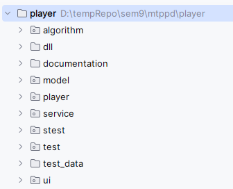
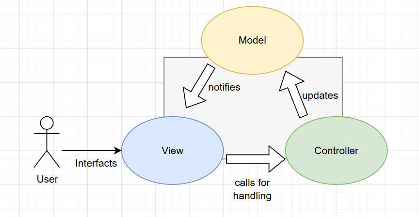
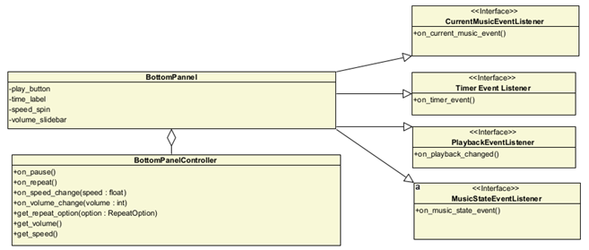

# Developer Guide

Music Player is an open-source desktop music player. We use `vlc` as our primary music player library and `mutagen` for music metada. All necessary requirements for Pyton are listed in the `requirements.txt` file

## Contribution

The project uses `Git` for version control. The code is distributed using GitHub [repository](https://github.com/MouseCreator/ModuloCalculator).
To add changes to the repository, create a fork and then merge it using a Pull Request.

## Project Structure

The project is separated into multiple directories to keep things organized.

The project consists of next set of directories:
- `algorithm` is a Python module contains implementations of custom basic algorithms such as sorting and shuffling.
- `dll` contains external dll files which may be imported from code
- `documentation` contains guides for users and developers.
- `model` is a Python module that contains models.
- `player` is a Python module that contains libraries and files related to the player.
- `service` is a Python module that contains services
- `stests` is a Python module for system tests
- `test` is a Python module for unit and integration tests
- `test_data` contains data used in tests to separate resources from test files
- `ui` is a Python module related to user interface and interaction with the program API
- root directory contains common Python files and generic configuration

Python dependencies and versions are stored in requirements.txt file

## MVC

We use MVC model. Model layer contains the state of the program - user settings, loaded songs, playlists.
Once models are changed they notify the program via callbacks. View represents the state using graphical user interface.
User sees the changes and applies changes via views. Controller is a middle layer connecting views and models.
Controllers listen to the user actions performed on views and then call method on models, which then update the view via callbacks.

## Event System

The program has self-contained event system, which implements Observer and Mediator patterns.
We use listener interfaces to filter the classes that should receive certain events.
The `Subscribers` class is the core of the event system which is used for publishing events and subscribing to them.

## Music States

There are three states of the program - PAUSED, PLAYING and FINISHED.
PLAYING means the music is being actively executed by the music player.
PAUSED means the music hasn't done executing, but was manually paused by the user.
FINISHED means the music has reached the end of the execution.

The transition between the states is shown on the diagram below.

## Testing

We use `pytest` for testing. Before submitting changes to repository make sure to cover them with tests and that the tests pass.

The program has several layers of tests - unit, integration and system.
- unit tests are designed to test individual components; we create mocks for interfaces to isolate the tested component. 
- integration tests are designed to verify how individual components interact with each other.
- system tests make sure that core system components fulfill the requirements and the functionality work as expected. We don't use graphical user interface in system tests, but use controllers.

## Installer

First we need to create an executable. Make sure you have `pyinstaller` installed from `requirements.txt` before running the install script.
To create a new version of installer use `build.bat` script. You can call it from console as `./build`.
The installer is stored into `installer` folder. Then we need to wrap the app into an installer.
We use [Inno Setup](https://jrsoftware.org/isinfo.php) to create the installer. To modify the installation edit the `setup.iss` file.
