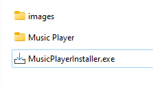
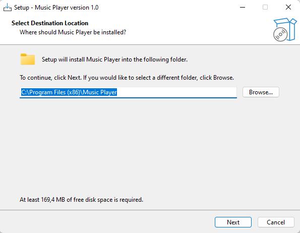
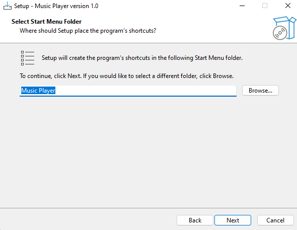
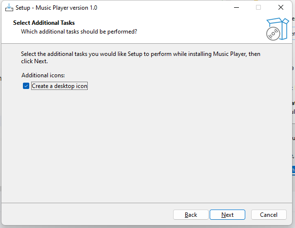
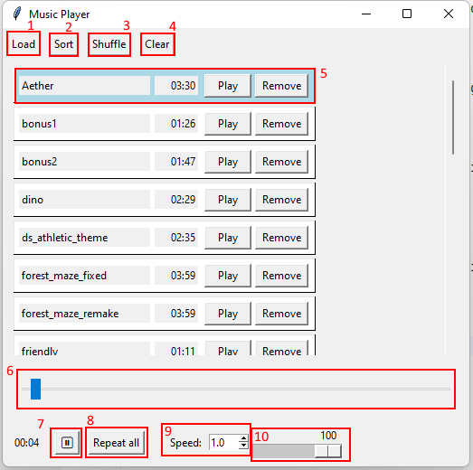

# User Guide

Music Player is a program for Windows that lets you play music files of different extensions.

## How to install it?

Before you start:

Independently of number of songs loaded, the player has almost no CPU consumption and uses up to 50 MB of RAM. The installed player needs 165 MB on your disk. The player uses DLL files for 64-bit processor architecture and compiler into binaries designed for Windows 10/11 operating system.

Step1. Launch the MusicPlayerInstaller.exe file 

Step 2. Select the folder you want to install it or use the default one.

Step 3. Create a Start Menu folder for the Music Player.

Step 4. Choose if you need to create a desktop icon (yes by default)

Step 5. Please support our developers by donating for our service. Thank you!

Step 6. Click install and wait for the installation to end.

Step 7. Launch the player after the installation finished. 
You can use `Music Player.exe` file in your destination folder, a Desktop icon or a Start menu icon. 

## How to use it?
The player has a Graphical user interface with the following elements:

1. Load button - allows you to open a File explorer and load your music. You may add several files at once.
2. Sort button - sorts the songs in alphabetical order.
3. Shuffle button - shuffles the songs in random order.
4. Clear button - removes all loaded songs from the player.
5. Music item - a song in your playlist. Click `Play` to make it the current song, click `Remove` to remove it from the list. You can change the order of songs by dragging them.
6. Seekbar - use it to rewind the song.
7. Pause button - click it to pause the song. Click again to unpause
8. Repeat button - toggle between 'No repeat' - don't repeat once no more songs left, 'Repeat all' - play all songs in loop, 'Repeat one' - play current song in loop.
9. Speed spin - set your playback speed between 0.1 and 8.0. Note that actual speed may be limited by your system.
10. Volume bar - change the volume of the song.

Enjoy the player!

If you encounter any problems please reach us via GitHub, music.player.support@mail.com or call +380 11 111 11 11.

